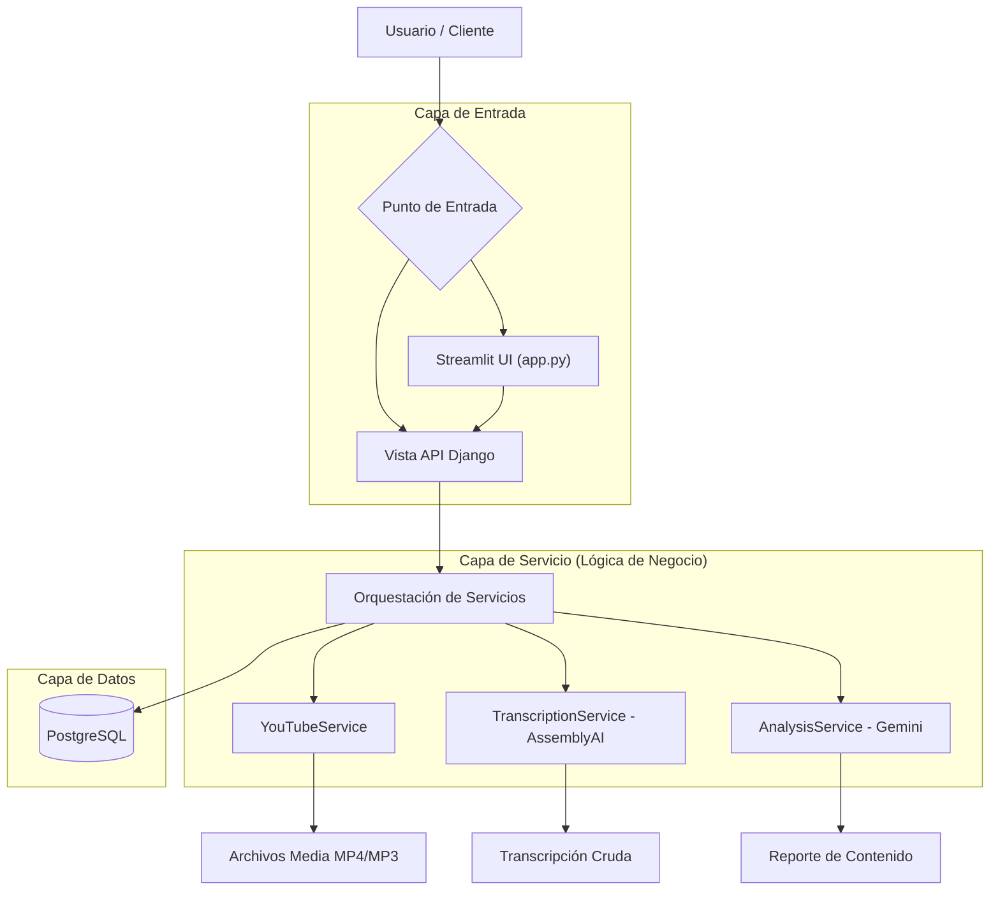

# Arquitectura Backend YT-AGENT-AI

## 📋 Tabla de Contenidos
- [Descripción General](#descripción-general)
- [Patrón de Arquitectura](#patrón-de-arquitectura)
- [Estructura de Directorios](#estructura-de-directorios)
- [Componentes Principales](#componentes-principales)
- [Flujo de Ejecución](#flujo-de-ejecución)
- [Referencia API](#referencia-api)

## 📖 Descripción General

El backend de **YT-AGENT-AI** está construido utilizando un enfoque de **Clean Architecture**, asegurando separación de responsabilidades, testabilidad y mantenibilidad. La lógica central está desacoplada del framework (Django) y de la UI (Streamlit), residiendo en **Servicios** dedicados.

Principios arquitectónicos clave:
*   **Capa de Servicios**: Encapsula la lógica de negocio (descarga de YouTube, Transcripción, Análisis de Contenido).
*   **Vistas Basadas en Clases (CBV)**: Maneja las solicitudes HTTP y el formato de respuesta.
*   **Excepciones Personalizadas**: Proporciona manejo de errores granular.
*   **Principios SOLID**: Aplicados en todo el código base.

## 🏗️ Patrón de Arquitectura

El flujo de datos sigue un camino estricto desde el punto de entrada (UI o API) hacia abajo hasta los servicios y la base de datos.



## 📁 Estructura de Directorios

```
Backend/
├── translation_generator_app/
│   ├── services/                 # Lógica de Negocio central
│   │   ├── __init__.py
│   │   ├── youtube_service.py    # contenedor (wrapper) de yt-dlp
│   │   ├── transcription_service.py  # integración con AssemblyAI
│   │   └── analysis_service.py   # integración con Google Gemini
│   │
│   ├── exceptions.py             # Jerarquía de Excepciones Personalizadas
│   ├── models.py                 # Modelos de base de datos
│   ├── serializers/              # Validación de datos
│   └── views/                    # Vistas de API
│
├── app.py                        # Aplicación Frontend Streamlit
├── Dockerfile                    # Definición del contenedor
├── docker-compose.yml            # Orquestación de desarrollo local
└── manage.py                     # Punto de entrada de Django
```

## 🧩 Componentes Principales

### 1. Servicios (`translation_generator_app/services/`)

*   **`YouTubeService`**: Maneja la extracción de video y audio.
    *   Usa `yt-dlp` con cabeceras personalizadas para evadir detección de bots (errores 403).
    *   Descarga video (MP4) y audio (MP3) por separado.
    *   Sanitiza los nombres de archivo.

*   **`TranscriptionService`**: Interactúa con AssemblyAI.
    *   Sube archivos de audio.
    *   Solicita la transcripción.
    *   Sondea (poll) hasta que se completa.

*   **`AnalysisService`**: Interactúa con Google Gemini.
    *   **Generación de Reporte de Contenido**: Analiza la transcripción completa y genera un reporte estructurado con 5 secciones:
        *   Temas principales tratados
        *   Argumento / resumen narrativo
        *   Opiniones o puntos de vista expresados
        *   Datos o hechos clave
        *   Conclusión / veredicto final
    *   **Cadena de modelos con fallback por cuota**: no usa un solo modelo. `PREFERRED_MODELS` (12 modelos en 6 tiers, ordenados por cuota restante) y `_try_with_fallback()` reintenta con el siguiente ante `429`/`quota`/`404`. Default: `gemini-3.5-flash-lite` (500 RPD); último recurso: `gemma-4-26b`/`gemma-4-31b` (14.4K RPD).
    *   Usa `temperature=0.5`, chunks de 8000 caracteres (máx. 30000) y llamada única si el texto es corto, para ahorrar cuota.

### 2. Interfaz Streamlit (`app.py`)

El frontend es un cliente HTTP puro de la API Django. **No** contiene lógica de negocio ni importa código Django.

*   **Cliente HTTP**: Llama a `POST /login/`, `POST /generate-report/` y `POST /logout/` con `requests`, guardando la cookie de sesión en `st.session_state`. La URL del backend se configura con `BACKEND_URL` (default `http://localhost:8000`; `http://backend:8000` en Docker Compose).
*   **Seguridad heredada**: Al pasar por la API, el uso vía Streamlit queda cubierto por la autenticación y el throttling DRF.
*   **Gestión de Estado**: Usa `st.session_state` para sesión, resultados y persistencia entre re-ejecuciones.
*   **Descargas**: Video/audio se obtienen de las `video_url`/`audio_url` (`/media/...`) de la respuesta, con la sesión; el PDF se genera localmente con `fpdf2`.
*   **Manejo de Errores**: Traduce los códigos HTTP (`401` sesión expirada, `429` throttling, `400`/`500`) a mensajes amigables al usuario.

### 3. Excepciones Personalizadas (`exceptions.py`)

*   `TranslationGeneratorException` (Base)
    *   `YouTubeDownloadException`
    *   `TranscriptionException`
    *   `AnalysisException`
    *   `InvalidDataException`

### 4. Seguridad API: autenticación + throttling (DRF)

*   **Autenticación**: sesión Django (`User` nativo). `POST /login/` abre sesión, `POST /logout/` la cierra, `POST /generate-report/` exige usuario autenticado (401 si no).
*   **Throttling**: `rest_framework.throttling.ScopedRateThrottle` como clase por defecto en `ai_translation/settings.py` (`REST_FRAMEWORK`). Cada vista declara su `throttle_scope`:
    *   `LoginView` → scope `login` (anti fuerza bruta, default `5/min`).
    *   `ContentAnalysisView` → scope `report` (operación costosa, default `10/hour`).
*   **Ajuste por entorno**: `LOGIN_THROTTLE_RATE` y `REPORT_THROTTLE_RATE` en `.env`, formato `<n>/<s|m|h|d>`. Al exceder el límite, DRF responde `429`.

## 🔄 Flujo de Ejecución

1.  **Entrada**: El usuario inicia sesión (Streamlit o `POST /login/`) y proporciona URL de YouTube y API Key de Gemini.
2.  **Descarga**: `YouTubeService` descarga medios a `media/`.
3.  **Transcripción**: `TranscriptionService` envía audio a AssemblyAI y obtiene texto.
4.  **Análisis**: `AnalysisService` envía la transcripción a Gemini y genera un Reporte de Contenido estructurado.
5.  **Persistencia**: resultado guardado en PostgreSQL vía Django ORM.
6.  **Visualización**: La API responde el reporte + `video_url`/`audio_url`; Streamlit lo muestra con botones de descarga (vía HTTP con la sesión) y PDF local.

## 📚 Referencia API

Aunque la app Streamlit es la interfaz principal, el backend expone un endpoint REST:

**Endpoint:** `POST /generate-report/`

**Payload:**
```json
{
    "link": "https://youtube.com/watch?v=...",
    "gemini_api_key": "AI..."
}
```

**Respuesta:**
```json
{
    "report": "Reporte de contenido...",
    "title": "Título del Video",
    "original_transcription": "Texto original...",
    "transcription_file": "/ruta/al/transcript.txt"
}
```
## ❓ Preguntas Frecuentes

- **¿Por qué el endpoint exige login?**
  `POST /generate-report/` verifica `request.user.is_authenticated` y responde `401` sin sesión. La sesión se abre con `POST /login/`.
- **¿Qué pasa si excedo el throttling?**
  DRF responde `429`. `LoginView` usa scope `login` (`5/min` por defecto) y `ContentAnalysisView` scope `report` (`10/hour`); ajustables con `LOGIN_THROTTLE_RATE` y `REPORT_THROTTLE_RATE`.
- **¿Un solo modelo de Gemini o varios?**
  Varios en cadena con fallback: `PREFERRED_MODELS` (12 modelos) y `_try_with_fallback()` reintenta ante `429`/`404`.
